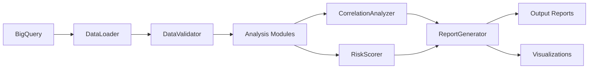

# Healthcare COI Analytics Template - Architecture

## System Architecture Overview

This document describes the architecture and design patterns used in the Healthcare COI Analytics Template v2.0.

## Directory Structure

```
182-healthcare-coi-analytics-template/
├── .env                    # Environment variables (GCP credentials, etc.)
├── .env.example           # Template for environment setup
├── .gitignore            # Git exclusion rules
├── CONFIG.yaml           # Main configuration file
├── README.md             # Project documentation
├── cli.py                # Command-line interface
├── requirements.txt      # Python dependencies
│
├── src/                  # Core application modules
│   ├── __init__.py
│   ├── data/            # Data management layer
│   │   ├── bigquery_connector.py  # Singleton BigQuery client
│   │   ├── data_loader.py         # Unified data loading
│   │   └── data_validator.py      # Data quality validation
│   ├── analysis/        # Analysis engines
│   │   ├── open_payments.py       # Payment analysis
│   │   ├── prescriptions.py       # Prescription analysis
│   │   ├── correlations.py        # Statistical correlations
│   │   ├── risk_scoring.py        # ML-based risk assessment
│   │   └── specialty_analysis.py  # Specialty patterns
│   └── reporting/       # Report generation
│       ├── report_generator.py    # Multi-format reports
│       ├── visualizations.py      # Chart generation
│       └── templates/              # Report templates
│
├── pipelines/           # Analysis orchestration
│   ├── __init__.py
│   └── full_analysis.py          # Complete pipeline
│
├── config/              # Configuration files
│   └── config.yaml               # Analysis parameters
│
├── data/                # Data directories
│   ├── inputs/         # Input data files (NPIs, etc.)
│   ├── raw/            # Original unprocessed data
│   ├── processed/      # Analysis outputs
│   ├── cache/          # BigQuery cache files
│   └── outputs/        # Final report outputs
│
├── reports/            # Generated reports
│   ├── investigative/  # Investigative style reports
│   ├── compliance/     # Compliance reports
│   └── executive/      # Executive briefings
│
├── notebooks/          # Jupyter notebooks
│   ├── exploratory/    # Data exploration
│   └── validation/     # Results validation
│
├── tests/              # Test suite
│   ├── test_data_loader.py
│   ├── test_analysis.py
│   └── test_reporting.py
│
├── docs/               # Documentation
│   ├── instructions/   # Report style instructions
│   ├── ARCHITECTURE.md # This file
│   └── examples/       # Example outputs
│
└── scripts/            # Utility scripts
    ├── utils/          # Helper utilities
    └── legacy/         # Archived old scripts

```

## Design Patterns

### 1. Singleton Pattern - BigQueryConnector
The `BigQueryConnector` uses the Singleton pattern to ensure only one BigQuery client exists throughout the application lifetime, reducing connection overhead and managing resources efficiently.

```python
class BigQueryConnector:
    _instance = None
    _client = None
    
    def __new__(cls):
        if cls._instance is None:
            cls._instance = super().__new__(cls)
        return cls._instance
```

### 2. Factory Pattern - Report Generation
The `ReportGenerator` uses a factory pattern to create different report styles based on configuration.

```python
def generate_report(self, style="investigative"):
    if style == "investigative":
        return self._generate_investigative_report()
    elif style == "compliance":
        return self._generate_compliance_report()
    # ...
```

### 3. Strategy Pattern - Analysis Modules
Each analysis module (`OpenPaymentsAnalyzer`, `PrescriptionAnalyzer`, etc.) implements a common interface with an `analyze_all()` method, allowing them to be used interchangeably.

### 4. Pipeline Pattern - Data Processing
The pipeline pattern is used to chain data processing steps in a consistent, maintainable way.

## Data Flow



## Key Components

### Data Layer (`src/data/`)

#### BigQueryConnector
- **Purpose**: Manages all BigQuery connections
- **Features**: 
  - Connection pooling
  - Query caching (24-hour TTL)
  - Automatic retry logic (3 attempts)
  - Error handling

#### DataLoader
- **Purpose**: Standardized data loading interface
- **Features**:
  - Automatic caching with Parquet files
  - Configuration-driven queries
  - Data versioning support
  - Cleanup utilities

#### DataValidator
- **Purpose**: Ensures data quality and integrity
- **Features**:
  - NPI validation (Luhn algorithm)
  - Statistical outlier detection
  - Data completeness checks
  - Type validation

### Analysis Layer (`src/analysis/`)

#### OpenPaymentsAnalyzer
- Payment distribution analysis
- Manufacturer concentration metrics
- Temporal trend analysis
- Gini coefficient calculation

#### PrescriptionAnalyzer
- Drug ranking algorithms
- Cost analysis
- Outlier prescriber detection
- Specialty pattern recognition

#### CorrelationAnalyzer
- Pearson/Spearman correlations
- Confidence interval calculations
- Effect size measurements (Cohen's d)
- ROI calculations

#### RiskScorer
- Multi-factor risk model
- Isolation Forest anomaly detection
- Provider scoring (0-100 scale)
- Risk categorization

#### SpecialtyAnalyzer
- Specialty vulnerability assessment
- Drug preference patterns
- Payment penetration analysis

### Reporting Layer (`src/reporting/`)

#### ReportGenerator
- Multiple output formats (Markdown, HTML)
- Three report styles:
  - Investigative: Narrative-driven
  - Compliance: Regulatory focus
  - Executive: High-level summary
- Jinja2 templating

#### VisualizationGenerator
- Matplotlib/Seaborn charts
- Conflixis branding
- Publication-ready outputs
- Interactive visualizations (optional)

## Configuration Management

The system uses a hierarchical configuration approach:

1. **Environment Variables** (`.env`): Credentials and secrets
2. **Main Config** (`CONFIG.yaml`): Health system settings, analysis parameters
3. **Runtime Parameters**: CLI arguments and function parameters

## Caching Strategy

1. **BigQuery Results**: 24-hour cache in `data/cache/`
2. **Processed Data**: Parquet files in `data/processed/`
3. **Analysis Results**: Timestamped outputs
4. **Automatic Cleanup**: Remove files older than 7 days

## Error Handling

- **Retry Logic**: 3 attempts for BigQuery operations
- **Graceful Degradation**: Continue with available data
- **Comprehensive Logging**: All operations logged
- **Validation Checkpoints**: Data validated at each step

## Performance Optimizations

1. **Query Optimization**: Server-side aggregation in BigQuery
2. **Caching**: Reduce redundant queries
3. **Parquet Format**: Efficient columnar storage
4. **Lazy Loading**: Load data only when needed
5. **Parallel Processing**: Available via Dask (optional)

## Security Considerations

1. **Credential Management**: Environment variables, never in code
2. **Data Privacy**: No PHI in logs or cache
3. **Access Control**: BigQuery IAM permissions
4. **Audit Trail**: All operations logged

## Testing Strategy

1. **Unit Tests**: Individual component testing
2. **Integration Tests**: Pipeline validation
3. **Data Quality Tests**: Validation rules
4. **Report Tests**: Output verification

## Deployment

### Local Development
```bash
python cli.py analyze --style investigative
```

### Production
- Containerization ready (Dockerfile can be added)
- Cloud Run compatible
- Airflow DAG integration possible

## Monitoring

- **Logging**: Structured logging throughout
- **Metrics**: Processing times, data volumes
- **Alerts**: Configurable thresholds
- **Health Checks**: Data quality monitoring

## Future Enhancements

1. **Real-time Processing**: Stream processing support
2. **API Interface**: REST API for integration
3. **Web Dashboard**: Interactive visualization
4. **ML Models**: Advanced predictive analytics
5. **Multi-tenancy**: Support multiple health systems

## Dependencies

### Core Dependencies
- `pandas`: Data manipulation
- `numpy`: Numerical operations
- `google-cloud-bigquery`: BigQuery integration
- `scikit-learn`: Machine learning

### Analysis Dependencies
- `scipy`: Statistical analysis
- `statsmodels`: Advanced statistics

### Visualization Dependencies
- `matplotlib`: Base plotting
- `seaborn`: Statistical visualization

### Reporting Dependencies
- `jinja2`: Template engine
- `markdown`: Markdown processing

## Maintenance

### Regular Tasks
1. Clear cache weekly: `python cli.py clean --days 7`
2. Validate data quality: `python cli.py validate`
3. Update dependencies quarterly
4. Review and archive old reports

### Troubleshooting
- Check logs in `logs/` directory
- Validate BigQuery credentials
- Ensure data freshness
- Review cache validity

---

*Last Updated: September 2025*
*Version: 2.0.0*